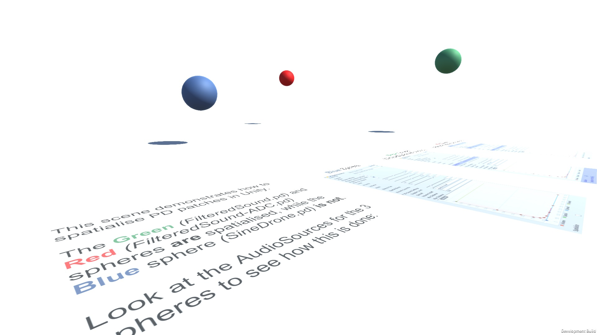

# LibPdIntegrationExamples

Unity project demonstrating how to use the [LibPdIntegration](https://github.com/LibPdIntegration/LibPdIntegration) libpd Unity wrapper. Contains multiple scenes, each focused on a specific topic. Still in development.

## Completed Demonstration Scenes

- Spatialisation
- Communication from Unity to libpd
- Communication from libpd to Unity
- libpd MIDI handling

## Still to Come

- Arrays

- Pure Data lists/messages

Developed by [Niall Moody](http://www.niallmoody.com) at [Abertay University](http://www.abertay.ac.uk), with assistance from [Yann Seznec](http://www.yannseznec.com/). Licensed under the [MIT License](LICENSE.txt).